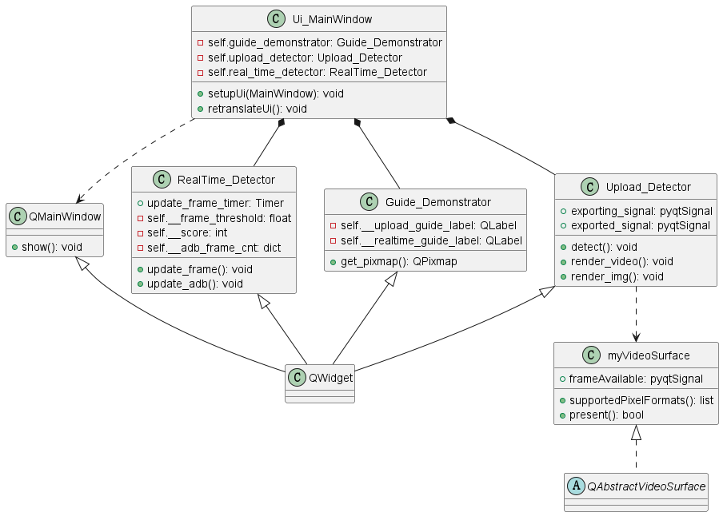
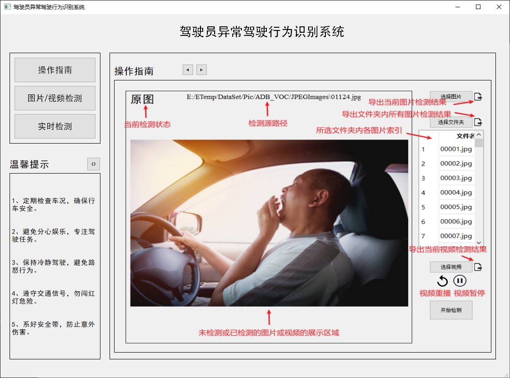

# 异常驾驶行为识别系统

## 一、项目描述
1.本项目旨在检测驾驶员在驾驶过程中可能发生的异常驾驶行为，并实时量化、评估当前的危险程度，予以驾驶员一定程度的提醒操作。具体而言，本项目主要检测驾驶员可能出现的疲劳驾驶行为和分心驾驶行为。通过为每一异常行为分配动态权重，得到了当前安全得分。根据得分，系统会在恰当时机对驾驶员予以提醒。

2.该项目的界面采用了PyQt5实现，

3.该系统能够检测八种行为：<睁眼, eye_open>,<闭眼, eye_close>,<嘴巴, mouth>, <打哈欠, yawn>, <脸, face>, <抽烟, smoke>,<使用手机, phone>, <喝水, drink>。其中闭眼、打哈欠、抽烟、使用手机、喝水这五种行为被视作异常驾驶行为。检测使用了[YOLOv8](https://github.com/ultralytics/ultralytics)在自制数据集上训练的模型，模型在验证集上的PR曲线：
<div style="text-align:center;">

</div>

4.该项目主要实现了以下功能：

&emsp;&emsp;(1)操作指南页面：用户能够通过点击翻页按钮来快速浏览系统功能操作说明。

&emsp;&emsp;(2)图片/视频检测页面：用户能够上传图片、图片文件夹、视频进行检测，并且能够批量导出检测结果至本地。

&emsp;&emsp;(3)实时检测页面：调用本地摄像头进行实时检测，具有预警功能，支持生成、导出检测日志和得分曲线。

## 二、文件结构
```commandline
abnormal-driving-behavior
│  README.md
│  requirements.txt
├─ assets
|  └─...
│
└─adb-detector
   │  main.py                 # 🔺整个项目的运行入口
   │  mainwindow.py           # 创建系统窗口以及各组件
   |  guide_demonstrator.py   # 1.操作指南页面
   │  upload_detector.py      # 2.图片/视频检测页面
   │  real_time_detector.py   # 3.实时检测页面
   |  load_plot.py            # 用于加载实时检测中保存的PlotWidget绘图数据
   │  video_surface.py        # 图片/视频检测中用来获取QMediaPlayer输出的视频帧
   │
   ├─logs                     # 实时检测中的日志、绘图数据保存位置
   |
   ├─resource                 # 界面使用的图片、音频、模型权重
   │  ├─audio
   │  ├─background
   │  ├─button
   │  ├─guide_img
   │  └─model_weight
   │
   └─result                   # 图片/视频检测中导出的检测结果
      ├─file
      ├─folder
      └─video
```
1.`main.py`是整个项目的运行入口，代码会调用`mainwindow.py`创建窗口。

2.`mainwindow.py`主要会执行以下步骤：

&emsp;&emsp;(1)创建操作指南页面，通过创建`guide_demonstrator.py`中`Guide_Demonstrator`类的对象完成。

&emsp;&emsp;(2)创建图片/视频页面，通过创建`upload_detector.py`中`Upload_Detector`类的对象完成。

&emsp;&emsp;(3)创建实时检测页面，通过创建`real_time_detector.py`中`RealTime_Detector`类的对象完成。

3.项目使用YOLOv8在自制数据集上训练的模型进行检测，模型位于`./adb-detector/resource/model_weight/best.pt`。

可以将其替换为自己训练的模型，然后在`main.py`里面修改`get_yolo_weight()`函数返回的路径，各页面均通过该函数获取模型路径。

<br/>

（可选阅读）

4.`video_surface.py`是在图片/视频检测中获取`QMediaPlayer`输出的视频帧，便于模型进行检测。

5.`load_plot.py`能够读取`.pkl`文件获取`PlotWidget`绘图数据进行绘图，`.pkl`文件通过实时检测页面中保存绘图数据获得。

## 三、类图

<div style="text-align:center;">

</div>

## 四、使用说明
Windows系统下，在cmd中cd到requirements.txt所在目录下，执行以下命令，以安装项目所需包
```commandline
pip install -r requirements.txt
```
完成后，打开项目，运行adb-detector/main.py即可

## 五、（可选阅读）实时检测中的得分机制
系统会为每一异常驾驶行为分配默认权重，同时每一异常行为还会拥有一个权重放大系数`lambda`，该系数会随异常行为持续时间的增加而增大，用来纠正驾驶员某一长时间的异常行为。

具体而言，每一异常行为都会分配一个计时器，默认状态下，计时器为停止状态。当某种异常行为发生时，该异常行为的计时器将会启动，并每3秒检测一次该异常行为是否仍在持续。若仍在持续，则权重放大系数会从0以0.2的步长逐渐增加至1后停止。

故`lambda = min(0.2 * count, 1)`，异常行为实际权重为`(1 + lambda) * weight`。

## 六、界面展示
### 操作指南页面


### 图片/视频检测页面


### 上传视频检测


### 实时检测页面


